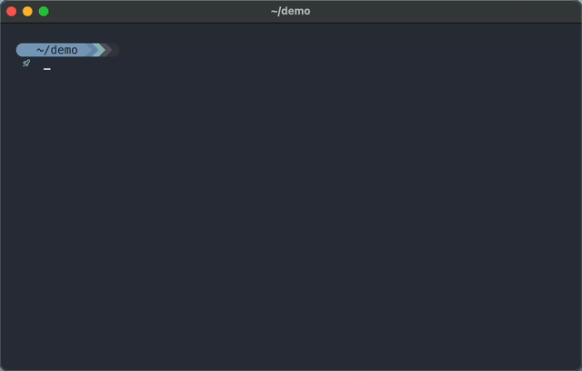

---

> ### cstructer
> Proof of concept using LuaJIT Foreign Function Interface (FFI) library to both define and generate C-style tables at run time.
> This approach only supports byte aligned structures (packed) to avoid any alignment assumptions made by the compiler.
> 

>  
> 

---

> ### readonly-tables
> Proof of concept for creating a near read-only table in Lua. The debug library can override `__metatable` but this still remains a practical approach for reasons such as ...
> - A function called `read_only` with `__metatable = false` clearly communicates intent. The intent is that this table should not have its behavior modified at runtime. It signals to myself and others that doing so is unsupported. It also communicates that such behavior is discouraged and could cause subtle bugs.
> - A common security phrase is "Defense in Depth". This suggests that good software practices include layering protections. Just because the debug library exists does not mean I should ignore the value of basic protection in normal operation.
> - I am not necessarily protecting against malicious attacks. I am also protecting against accidental misuse, confusion, or honest mistakes. This includes mistakes by others and by myself during development.
> - At any mature point in development, I can still lift these restrictions. Nothing is stopping me from removing `__metatable = false` later. Adding it now as a safeguard against myself seems perfectly reasonable.
